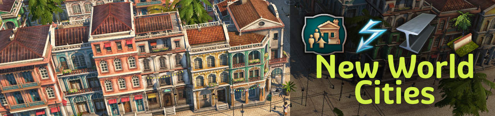

# New World Cities

New population tiers, products, industries and tons of new visual assets (custom models, skins, ...).

## Download and Description

You can add the mod to an existing save game without any drawbacks.

- Download: [Mod.io](https://mod.io/g/anno-1800/m/jakob-new-world-cities) or [GitHub releases](https://github.com/anno-mods/new-world-cities/releases)
- Description: [README](./mods/addon-new-world-cities/README.md)
- Changelog: [Changelog](./mods/addon-new-world-cities/README.md#changes)

### New World Tier 4

Tier 4 is work in progress. You can only try it out if you follow the steps from [Build and Modify Yourself](#build-and-modify-yourself).

## Contribute

Contributions are welcome.
Ask @jakob in the modding discord if you need any help.

### Translations

Contact @jakob in the modding discord, or just open a Pull Request.

### Bugfixes and Features

- Use GUIDs from range 1.500.040.000 to	1.500.049.999
- Use only assets you created your own, or the license allows the usage
- Don't break savegames
- Don't change vanilla behavior
- TBD

## Build and Modify Yourself

The mods are made with the [Modding Tools for Anno](https://marketplace.visualstudio.com/items?itemName=JakobHarder.anno-modding-tools) extension for [VS Code](https://code.visualstudio.com/).
Install the plugin, open a mod folder and press `F1` and choose `Build Anno Mod`.
