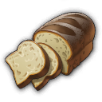
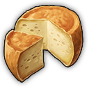
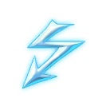

# Progression

## New World Needs

### Jornaleros

Need | Consumption | Residents | Coins
--- | --- | --- | ---
Tortillas | 0.000238095 | 5 | 5
 Bread | 0.000238095 | 5 | 5
 Cheese | 0.000238095 | 5 | 5

### Obreros

Need | Consumption | Residents | Coins
--- | --- | --- | ---
(Tortillas) | 0.00047619 | 4 | 2
 Bread | 0.00047619 | 5 | 5
 Cheese | 0.00047619 | 5 | 5
 Electricity | - | 5 | 2

### Artistas

Need | Consumption | Residents | Coins | Required | Unlock
--- | --- | --- | --- | --- | ---
(Tortillas) | 0.00047619 | 5 | (10) 15
(Scooter) | 0.00002898 | 5 | (45) 67 | 6000/8000
| | **Terraced Artista** |
 Bread | 0.00047619 | 5 | 45
 Electricity | - | (20) | (45)
 Gramophones | 0.00011905  | 5  | 48  | 3200/6000
| | **Artista Skyscraper** |
 Sardines | 0.00011905 | 10  | 60  | 6000/8000
Violins | 0.000053 | 10 | 75

### Patronos

Need | Consumption | Residents | Coins | Required | Unlock
--- | --- | --- | --- | --- | ---
 Electricity | - | ? | ?
 Gramophones | 0.00011905  | ?  | ?  | ?
 Sardines | 0.00011905 | ?  | ?  | ?